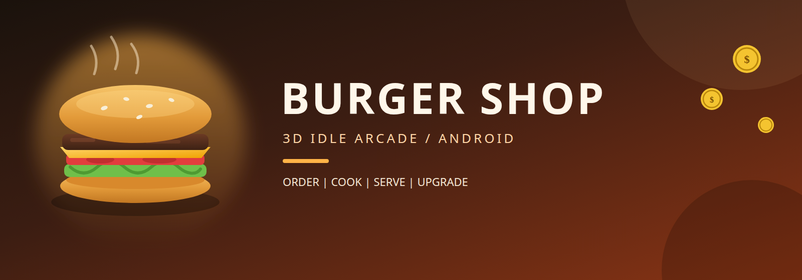
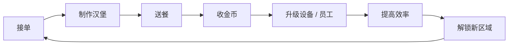

<p align="center">
  
</p>

<h1 align="center">Burger Shop</h1>

<p align="center">
  <strong>一款面向 Android 的单人 3D 汉堡店经营游戏</strong><br>
  斜俯视 · 单指摇杆 · 持续扩店
</p>

<p align="center">
  
  
  
  
</p>

<p align="center">
  <a href="#核心循环">核心循环</a> ·
  <a href="#第一间店">第一间店</a> ·
  <a href="#技术基线">技术基线</a> ·
  <a href="#当前进度">当前进度</a> ·
  <a href="#本地打开">本地打开</a>
</p>

---

## 关于游戏

玩家经营一间汉堡店：制作、送餐、收款，再把金币投入设备和员工。自动化只在玩家先理解手动循环之后出现，节奏会随着升级逐步加快。

| 项目 | 说明 |
| --- | --- |
| 类型 | 3D Idle Arcade / Tycoon |
| 平台 | Android 优先，竖屏 |
| 视角 | 斜俯视第三人称 |
| 操作 | 单指虚拟摇杆 |
| 单局 | 持续经营，逐步扩店 |
| 版本 | `0.1.0` · 工程初始化 |

第一版使用原创占位几何体验证手感与节奏，不依赖付费素材。玩法借鉴经营循环，名称、美术和内容会保持独立设计。

## 核心循环



体验原则：

- 玩家始终清楚下一步去哪里
- 每次交付都有金币、音效和视觉反馈
- 先手动跑通循环，再引入自动化
- 金额、库存和队列状态必须守恒

## 第一间店

首版限制在 **一个店铺、一种主商品、一条售卖动线**。

| 设施 | 数量 | 作用 |
| --- | ---: | --- |
| 烤台 | 1 | 按时间产出汉堡 |
| 取餐台 | 1 | 拾取、堆叠、携带 |
| 收银点 | 1 | 顾客付款离场 |
| 排队点 | 3 | 顾客进入并下单 |
| 升级点 | 1 | 用金币提升效率 |

MVP 验收见 [`SPEC.md`](SPEC.md)：核心循环可连续完成 3 次，Android 真机可启动和操作。

## 技术基线

| 项目 | 版本 |
| --- | --- |
| Unity | 6.3 LTS `6000.3.23f1` |
| 渲染管线 | Universal Render Pipeline `17.3.0` |
| 输入 | Input System `1.20.0` |
| UI | uGUI `2.0.0` |
| 构建 | Android Build Support |
| 最低 SDK | Android 25 |

## 仓库结构

```text
BurgerShop/
├── Assets/
│   ├── _Project/          # 游戏内容（脚本、场景、美术、UI）
│   │   ├── Scripts/
│   │   │   ├── Player/
│   │   │   ├── Customer/
│   │   │   ├── Restaurant/
│   │   │   ├── Economy/
│   │   │   ├── Core/
│   │   │   └── UI/
│   │   ├── Art/ Audio/ Materials/ Prefabs/ Scenes/ UI/
│   ├── Scenes/            # Unity 模板场景
│   └── Settings/          # URP 与渲染配置
├── Packages/              # 包清单与锁定文件
├── ProjectSettings/       # 工程与平台设置
├── docs/                  # 设计、目标与启动草案
├── SPEC.md                # MVP 范围与验收
└── README.md
```

`Library/`、`Temp/`、`Logs/` 等 Unity 生成目录已从版本控制中排除。

## 当前进度

目前可在 Play Mode 移动、等待烤台生产，并走到绿色取餐区自动拾取、堆叠和携带汉堡。

| Goal | 内容 | 状态 |
| ---: | --- | --- |
| 00 | 创建 Unity 6.3 LTS URP 项目 | 完成 |
| 01 | 玩家移动与摄像机跟随 | 完成 |
| 02 | 制作台定时产出汉堡 | 已实现，PR #7 待合并 |
| 03 | 拾取、堆叠与携带 | 已实现，功能分支验收通过 |
| 04 | 顾客生成、排队与下单 | 待做 |
| 05 | 送餐、付款与离场 | 待做 |
| 06 | 金币与升级点 | 待做 |
| 07 | 员工自动搬运 | 待做 |
| 08 | 本地存档 | 待做 |
| 09 | Android 构建与真机验证 | 待做 |

完整勾选列表见 [`docs/GOALS.md`](docs/GOALS.md)。

## 本地打开

1. 安装 [Unity Hub](https://unity.com/download) 与 **Unity `6000.3.23f1`**，并勾选 **Android Build Support**。
2. 克隆本仓库，用 Hub 打开仓库根目录。
3. 打开 `Assets/Scenes/SampleScene.unity`。
4. 进入 Play Mode。场景会生成占位地面、角色、烤台、绿色取餐标记和左下角虚拟摇杆。
5. 用 **WASD** 或拖动摇杆在 XZ 平面走动，确认斜俯视摄像机跟随，且角色不会走出围墙。
6. 等烤台生产后走到绿色圆形取餐区，汉堡会逐个移到角色身前，最多携带 **4 个**。上方显示数量，满载后停止拾取。当前阶段尚未实现售卖。

Goal 03 的功能说明和测试边界见 [`docs/goal-03-carry.md`](docs/goal-03-carry.md)。2026-09-11 本机 Unity 的 13 项测试全部通过，其中一项打开真实 SampleScene 并进入 Play Mode；这不代表 Android 真机已验收。

后续玩法会落到 `Assets/_Project/`。涉及操作手感、队列或存档的改动，需要在 Editor 和目标 Android 设备上试玩确认。

## 文档

| 文档 | 内容 |
| --- | --- |
| [`SPEC.md`](SPEC.md) | MVP 范围与首版验收 |
| [`docs/GAME_DESIGN.md`](docs/GAME_DESIGN.md) | 品类、第一间店与体验原则 |
| [`docs/GOALS.md`](docs/GOALS.md) | 分阶段目标 |
| [`docs/project-kickoff.md`](docs/project-kickoff.md) | 启动草案、里程碑与协作约定 |
