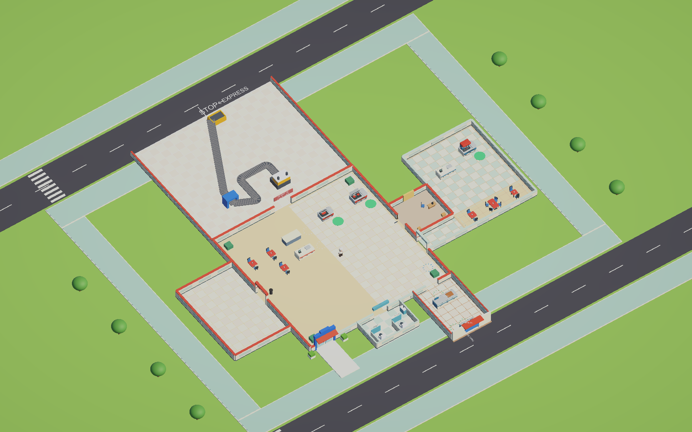
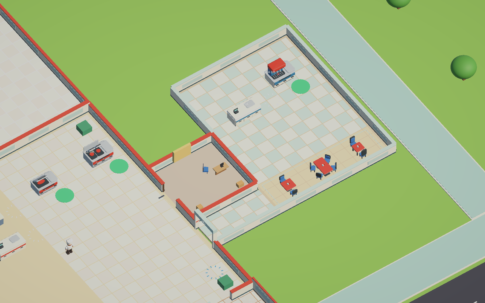
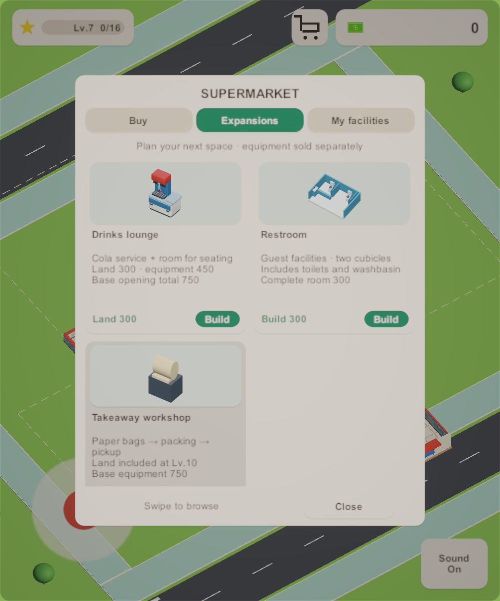
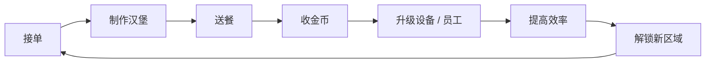

<p align="center">
  
</p>

<h1 align="center">Burger Shop</h1>

<p align="center">
  <strong>面向 Android 的单人 3D 汉堡店经营原型</strong><br>
  斜俯视 · 单指摇杆 · 制作、送餐、扩店
</p>

<p align="center">
  Android-first 3D burger-shop prototype: cook, serve, collect coins, and expand.<br>
  Unity 6.3 LTS · URP · one-thumb stick. Public prototype, not a store release.
</p>

<p align="center">
  
  
  
  
  
  
</p>

<p align="center">
  <a href="https://github.com/Ic3Ma0/BurgerShop">GitHub</a> ·
  <a href="#english-summary">English</a> ·
  <a href="#核心循环">核心循环</a> ·
  <a href="#现在能玩什么">现在能玩什么</a> ·
  <a href="#本地打开">本地打开</a> ·
  <a href="#文档">文档</a>
</p>

<p align="center">
  
</p>
<p align="center">
  
  
</p>

---

## English summary

Burger Shop is an Android-first, single-player 3D hamburger restaurant prototype in Unity 6.3 LTS (URP). Cook food, serve customers, collect coins, hire staff, and expand the shop. Version **0.3.0** is a public prototype, not a store listing.

- **Controls:** one-thumb virtual stick (WASD in the Editor)
- **Open in Unity:** clone this repo, install Unity `6000.3.23f1` with Android Build Support, open `Assets/Scenes/SampleScene.unity`
- **License:** [MIT](LICENSE) (Copyright © 2026 Ic3 Ma0)
- **Contributing:** [CONTRIBUTING.md](CONTRIBUTING.md)

The sections below stay in Chinese. In-game copy is English.

## 关于游戏

玩家经营一间汉堡店：烤制、取餐、送到柜台或餐桌、收金币，再把收入投入设备、员工和扩建。自动化只在手动循环跑通之后出现，节奏随升级加快。

| | |
| --- | --- |
| 类型 | 3D Idle Arcade / Tycoon |
| 平台 | Android 优先，竖屏 |
| 视角 | 斜俯视第三人称 |
| 操作 | 单指虚拟摇杆（Editor 也可用 WASD） |
| 版本 | `0.3.0` 原型，尚未上架商店 |

首版用原创占位几何体验证手感与节奏，不依赖付费素材。

## 核心循环



- 玩家始终清楚下一步去哪里
- 每次交付都有金币、音效和视觉反馈
- 先手动跑通循环，再引入自动化
- 金额、库存和队列状态必须守恒

## 现在能玩什么

MVP **0.1.2**（Goal 00–09）已完成：移动、烤台、取餐搬运、顾客排队、收银、升级、雇人、本地存档，以及 Android 真机可玩。

当前 **0.3.0** 在此之上继续扩店，包括柜台库存与堂食、打包与得来速、员工与人事办公室、店铺等级与侧翼设施、本地进度保存。

完整勾选列表见 [`docs/GOALS.md`](docs/GOALS.md)。规格与交付记录在 [`docs/specs/`](docs/specs/)。

## 技术基线

| 项目 | 版本 |
| --- | --- |
| Unity | 6.3 LTS `6000.3.23f1` |
| 渲染 | Universal Render Pipeline `17.3.0` |
| 输入 | Input System `1.20.0` |
| UI | uGUI `2.0.0` |
| 最低 SDK | Android 25 |
| 包名 | `com.ic3ma0.burgershop` |

场景在运行时由 `Assets/_Project/Scripts/Core/Goal01Bootstrap.cs` 组装，而不是靠预先摆好的大量 prefab。

## 本地打开

```bash
git clone https://github.com/Ic3Ma0/BurgerShop.git
```

1. 安装 [Unity Hub](https://unity.com/download) 与 **Unity `6000.3.23f1`**，并勾选 **Android Build Support**。
2. 用 Hub 打开仓库根目录，打开 `Assets/Scenes/SampleScene.unity`。
3. 进入 Play Mode。用 **WASD** 或左下角摇杆在店内走动。
4. 烤台出餐后走到取餐点携带汉堡，再送到柜台或餐桌完成交付、收金币。
5. 赚到金币后可升级烤台、雇佣员工、解锁新设施。进度会写入本地存档。

Android 构建与安装：

```bash
bash scripts/build-android.sh
bash scripts/install-android.sh
```

环境说明见 [Goal 09 Android](docs/goal-09-android.md)。`Library/`、`Temp/`、`Logs/`、`Builds/` 已从版本控制中排除。

## 文档

| 文档 | 内容 |
| --- | --- |
| [`SPEC.md`](SPEC.md) | MVP 范围与首版验收 |
| [`docs/GAME_DESIGN.md`](docs/GAME_DESIGN.md) | 品类、第一间店与体验原则 |
| [`docs/GAME_CORE.md`](docs/GAME_CORE.md) | 经营内核与节奏 |
| [`docs/GOALS.md`](docs/GOALS.md) | 分阶段目标 |
| [`docs/specs/`](docs/specs/) | 功能规格与交付记录 |
| [`LICENSE`](LICENSE) | MIT license |
| [`CONTRIBUTING.md`](CONTRIBUTING.md) | How to set up, branch, and open a PR |

仓库：https://github.com/Ic3Ma0/BurgerShop
