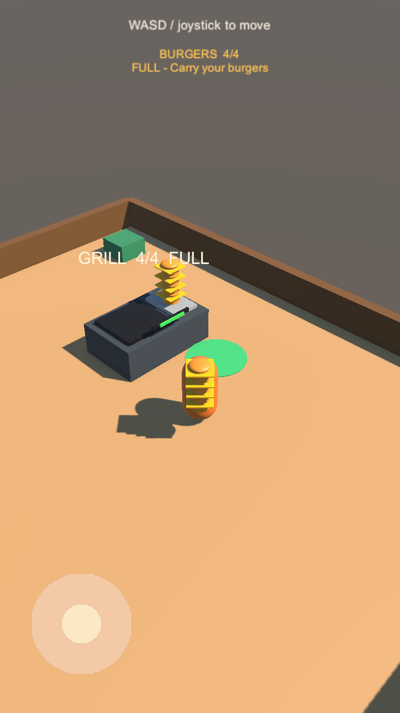

# Goal 03：拾取、堆叠与携带

## 玩家体验

1. 打开 `Assets/Scenes/SampleScene.unity`，点击 Play 并切到 Game。
2. 烤台每 3 秒产出一个汉堡，最多存放 4 个。
3. 用 WASD 或左下角摇杆走到烤台出餐侧的绿色圆形取餐区。
4. 有库存时自动拾取，首个立即拾取，后续间隔至少 0.25 秒，最多携带 4 个。
5. 汉堡在角色身前逐个堆叠，随角色移动和转向；上方显示 `BURGERS n/4`。
6. 离开取餐区后停止拾取。携带达到 4 个时显示 `FULL`，烤台库存不再被取走。

本阶段还没有顾客和售卖点，因此满载后可以携带移动，但不能通过玩家操作交付汉堡。后续送餐使用库存扣除接口。

Unity 实际渲染的竖屏满载预览（测试脚本设置角色位置与库存用于画面检查）：



## 实现约定

- 玩家携带上限：默认 4；`BurgerInventory.capacity` 可在 Inspector 配置。
- `BurgerInventory.Configure(...)` 也可设置容量和初始化堆叠锚点；容量不会被调整到低于当前携带数量。
- 取餐点：烤台局部坐标 `(1.05, 0.015, -2.1)`，XZ 平面半径 1，位于柜台外可走到的位置。
- 每次拾取最多转移 1 个；帧率短暂下降时不会一帧填满整个堆叠。
- `ProductionStation.TryTakeBurger(out Transform)` 在扣库存时立即移出并返回原模型，由携带者接管。
- 原有无参数 `TryTakeBurger()` 保留；同帧多次调用能正确移除不同模型。
- `BurgerInventory.TryCollectFrom(...)` 检查容量后接收模型；`TryTakeBurger()` 为后续送餐释放容量，空库存返回 false。
- 模型与材质一同转移，不在拾取时重新创建材质；销毁汉堡时释放它持有的材质。
- 汉堡和绿色取餐标记没有有效碰撞体，不影响角色移动。
- `BurgerPickupZone` 管理范围与拾取间隔；`CarryHud` 显示携带数量、取餐提示与满载状态。

## 自动验证

2026-09-11 本机 Unity `6000.3.23f1` 在独立项目副本中运行：**13 passed / 0 failed**（12 项组件测试 + 1 项真实场景玩法测试），无 C# 编译错误或警告。`unity projects verify` 与 `git diff --check` 均通过。

`BurgerCarryTests` 覆盖空库存、模型与库存同步、容量限制、释放容量、范围、间隔、暂停/禁用、堆叠跟随和材质生命周期。

`Goal03GameplayTests` 在 EditMode 测试流程中打开真实 SampleScene 并进入 Play Mode，验证自然生产、键盘走到取餐区、自动满载、HUD、满载保护、同帧移除、释放容量后恢复拾取、负重移动、摇杆处理与摄像机跟随。

场景测试使用 60 帧固定时间步和虚拟键盘，防止后台无渲染运行时的极高帧率让单帧位移低于 CharacterController 的最小移动阈值。测试结束恢复输入与时间设置。

另已检查 720×1280 竖屏及 1280×720 横屏的 Unity 渲染预览，确认 HUD、绿色取餐标记及角色堆叠可见；烤台库存文字已上移以避免与汉堡堆重叠。

建议在独立测试副本中执行，避免测试切换场景影响正在编辑的关卡：

```sh
Unity -batchmode -projectPath "$TEST_PROJECT" \
  -runTests -testPlatform EditMode \
  -testResults "$TEST_RESULTS" -logFile "$TEST_LOG"
```

摇杆测试调用指针处理函数，未代替 Android 实机触控验收。Android 构建、真机手感与长时间性能属于后续验证范围。
