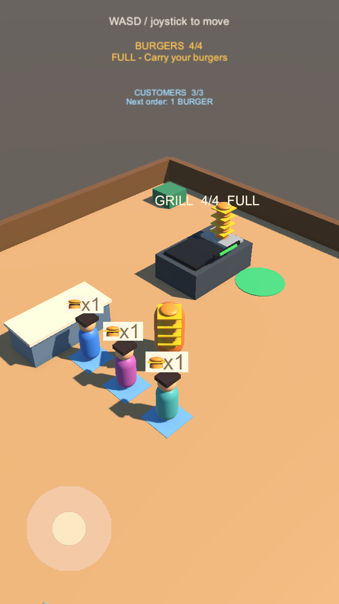

# Goal 04：顾客生成、排队与下单

## 玩家体验

打开 `Assets/Scenes/SampleScene.unity`，进入 Play Mode。点单台和三个蓝色排队位置会出现在烤台左侧。

1. 首位顾客在 1.5 秒后出现，之后每隔约 4 秒生成一位。
2. 顾客从左侧入口标记走进来，转弯后依次站到队列位置。行走中的顾客也占用名额，最多三人。
3. 到位后，每位顾客头顶显示一个汉堡图标及 `x1`，气泡始终面向镜头。
4. 队伍满后停止生成。顶部 `CUSTOMERS n/3` 显示人数，队首就绪后显示 `Next order: 1 BURGER`。
5. 原有 WASD、摇杆、自动取餐和四个汉堡携带上限保持可用。

本阶段顾客会等待订单。玩家送餐、顾客付款和离场属于 Goal 05，尚未接入；无需寻找隐藏的交付按键。

以下是 Unity 实际渲染的 720×1280 预览。临时画面检查脚本推进队列时间，并把玩家库存设为四个、烤台设为满库存，便于同时检查两套玩法的表现；正式场景仍按上述时间自然生成。



## 实现约定

- `CustomerQueue` 负责生成计时、名额预占、队列顺序及沿固定折线路径行走。默认移动速度 2.4，路径间距至少 1.2。
- 先更新前方顾客，再限制后方顾客的路径进度；转弯、短暂长帧和较短生成间隔都不会超越前方顾客。每次更新最多生成一位，避免卡顿后集中出现。
- 排队位置按队首到队尾传入；首间店有三个位置，间距 1.8。点单台中心为 `(-2, 0, 3.3)`，入口为 `(-8.2, 0, -4.4)`。
- `CustomerAgent` 持有队号、位置索引、到位状态和订单状态，`OrderSize` 固定为 1。顾客采用不同颜色的原创几何体；顾客和订单图标没有碰撞体。
- 顾客到达分配的位置才显示订单。补位移动期间保留订单，重新到队首位置后才允许交接。
- `TryDequeueReadyCustomer(out CustomerAgent)` 只移出已到位、已下单的队首，并隐藏气泡、重排剩余队列。调用方接管返回顾客，后续负责送餐、付款和离场；该接口本身不扣汉堡、不发金币。
- 满员期间不积累额外生成时间。名额释放后重新等待完整生成间隔；顾客对象意外销毁也会释放名额。
- 顾客销毁时释放自有身体和气泡材质，汉堡图标复用已有模型工厂并独立释放材质。
- `CustomerQueueHud` 显示人数及队首状态。既有携带 HUD 与取餐区逻辑不变。

这是首间店固定动线原型，未使用 NavMesh，也尚无绕开玩家或动态障碍的寻路。玩家可穿过顾客，点单台保留实体碰撞。

## 验证记录

2026-09-11，Unity `6000.3.23f1`，独立 Git 工作目录运行：**23 passed / 0 failed**。最终测试日志无 C# 编译错误、警告、异常或断言。项目完整性检查和 `git diff --check` 通过。

- 原有 13 项生产、拾取、携带与操作测试全部回归通过。
- 新增 9 项队列组件测试：延迟及暂停、到位点单及容量、转弯间距、长帧防集中生成、连续三轮补位、满队后计时恢复、销毁释放位置、材质释放、非法配置保护。
- 新增 1 项真实场景玩法测试：打开 SampleScene 并进入 Play Mode，通过正常 Update 等待三人排满，检查 HUD、气泡朝向和碰撞体，再连续三轮调用队首交接接口，确认补位和新顾客加入。
- 场景测试使用 60 帧固定时间步；退出后恢复。搬运测试保存并恢复输入设置字段，避免替换临时设置对象后影响下一次 Play Mode。
- 已检查 720×1280 竖屏及 1280×720 横屏的 Unity 渲染。临时截图工具未提交。截图运行时出现 Unity Editor SearchDatabase 缓存索引异常，仍成功生成预览；最终不含截图工具的测试运行无该异常。

本机结果保存在忽略的 `Logs/goal04-results.xml` 和 `Logs/goal04-tests.log`。复现命令：

```sh
Unity -batchmode -projectPath "$TEST_PROJECT" \
  -runTests -testPlatform EditMode \
  -testResults "$TEST_RESULTS" -logFile "$TEST_LOG"
```

当前验证范围为本机 Editor。Android 构建、实机触控、长时间性能以及完整送餐付款循环尚未验收。
