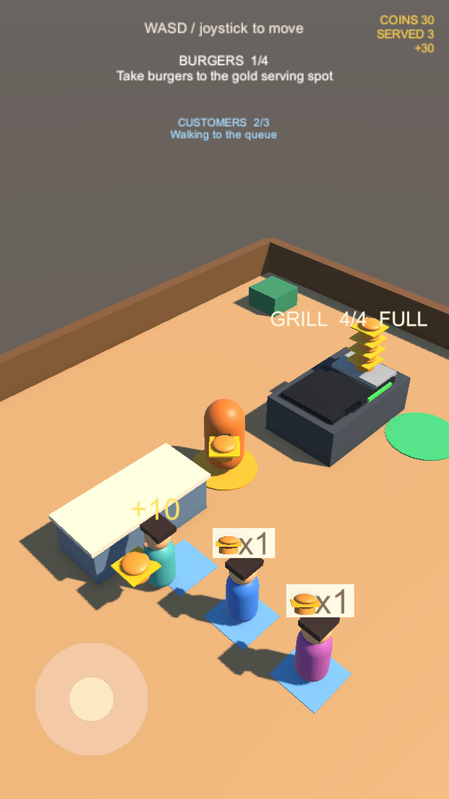

# Goal 05：送餐、付款与离场

## 玩家体验

打开 `Assets/Scenes/SampleScene.unity`，进入 Play Mode：

1. 在烤台的绿色圆形区域等待取餐，最多携带四个汉堡。
2. 绕过烤台，走到点单台右侧的金色圆形区域。队首顾客到位且玩家有汉堡时，自动交付一个。
3. 汉堡从玩家身前移向顾客手里，同时结算 **10 金币**。右上角显示累计 `COINS`、成交人数 `SERVED` 和短暂的收入提示，并播放短收款音效。
4. 顾客头顶显示 `+10`，带着汉堡从点单台左侧离开。顾客让出位置后，后排再上前；新顾客按生成间隔补入。
5. 带有多个汉堡时可以留在金色区域，自动接待后续顾客；空手、离开区域或队首尚未到位时不会成交。
6. 汉堡用完后回绿色区域补货，继续循环。

金币暂为本次运行收入，重开 Play 会归零。升级点和存档分别属于 Goal 06、08。

以下为 Unity 实际渲染的 720×1280 画面。临时截图脚本设置玩家位置、生产库存和排队进度，通过真实交付接口完成三笔交易，并暂停最后一位离场顾客以检查画面；右上角 `+30` 是这三笔同帧交易的合计提示，正常逐单成交显示 `+10`。



## 实现约定

- `BurgerServingZone` 配置顾客队列、玩家库存、钱包、交付点和离场路径。默认每单 10 金币，交付半径 0.85，最小交付间隔 0.75 秒，每次更新最多成交一笔。
- 正式场景金色区域中心为 `(0.9, 0.02, 3.3)`，位于点单台右侧可走到的位置。取餐与交付区域分离。
- 成交前检查范围、库存、已到位队首、队列/库存/钱包启用状态和有效金额。成交时移出队首、扣除一个携带汉堡并转移原模型、登记一笔收入；后续更新无法再次结算同一顾客。
- `BurgerInventory.TryTakeBurger(out Transform)` 立即移出原模型并把所有权交给顾客。无参数版本继续支持直接消耗，原有库存测试保留。
- `CustomerAgent.BeginDeparture` 接管汉堡，0.4 秒内将模型移到手中，随后沿预设出口路径离场。收款在交付动作开始、所有权转移时完成；离场和动画不会再次记账。
- `CustomerQueue` 保留刚移出顾客的让位检查；该顾客离开队首位置至少 1.2 单位后，后排才继续走动。顾客被销毁时也会解除等待。
- 离场路线先向左走到 `(-4.4, 0, 1.7)`，再经 `(-7.8, 0, 1.7)` 到 `(-7.8, 0, 5.8)`，绕开点单台及进店路径。到出口后销毁顾客和其持有汉堡，释放自有材质。
- `RestaurantWallet` 保存收入和成交笔数，拒绝非正金额，并通过 `SaleRecorded` 通知音效。尚无消费或持久化。
- `SaleFeedback` 使用运行时生成的双音提示，无外部音频素材；`SalesHud` 显示累计收入、成交笔数和短暂收入增量。
- 排队上限仍为三人，已成交离场的顾客不占排队名额。此版本使用固定路径，顾客没有实体碰撞，不包含动态避障。

## 验证记录

2026-09-11，Unity `6000.3.23f1`，独立工作目录运行 **32 passed / 0 failed**，无 C# 编译错误、警告、异常或断言。原有 23 项测试全部回归通过。项目完整性检查和 `git diff --check` 通过。

新增八项组件测试覆盖：空手/范围/未到位保护；原模型转移及单次付款；暂停和禁用依赖；队首让位间距；离开交付区后继续离场及材质释放；连续三单库存/金额/顺序；销毁离场顾客；非法金额与出口配置。

新增 `Goal05GameplayTests` 打开真实 SampleScene，通过虚拟键盘控制 CharacterController，沿可走通的路线连续往返三次。每次自动取餐、带到金色区域、交付一个汉堡并收入 10 金币；最终确认 30 金币、三笔成交、三位已服务顾客全部销毁、队列补回三人且队首为第四位。测试还检查了收入 HUD 和收款音频资源配置。

已检查 720×1280 竖屏及 1280×720 横屏渲染，金币 HUD、交付区域、汉堡转移和顾客收入提示均可见。截图工具启动时出现 Unity Editor SearchDatabase 缓存索引异常，但预览生成成功；不含该临时工具的正式测试运行无此异常。临时截图工具未提交。

测试结果与日志在本机忽略目录 `Logs/goal05-results.xml`、`Logs/goal05-tests.log`。复现：

```sh
Unity -batchmode -projectPath "$TEST_PROJECT" \
  -runTests -testPlatform EditMode \
  -testResults "$TEST_RESULTS" -logFile "$TEST_LOG"
```

本次完成 Editor 内的制作、搬运、送餐和收款循环。包含升级的完整 MVP、Android 构建、真机触控及长时间性能尚未验收。

## 分支依赖

本功能基于 Goal 04 的 `feat/goal-04-customer-queue`（PR #9）。合并时先集成 Goal 04，再把 Goal 05 PR 的比较基线调整为 main，避免漏掉顾客生成与排队代码。
