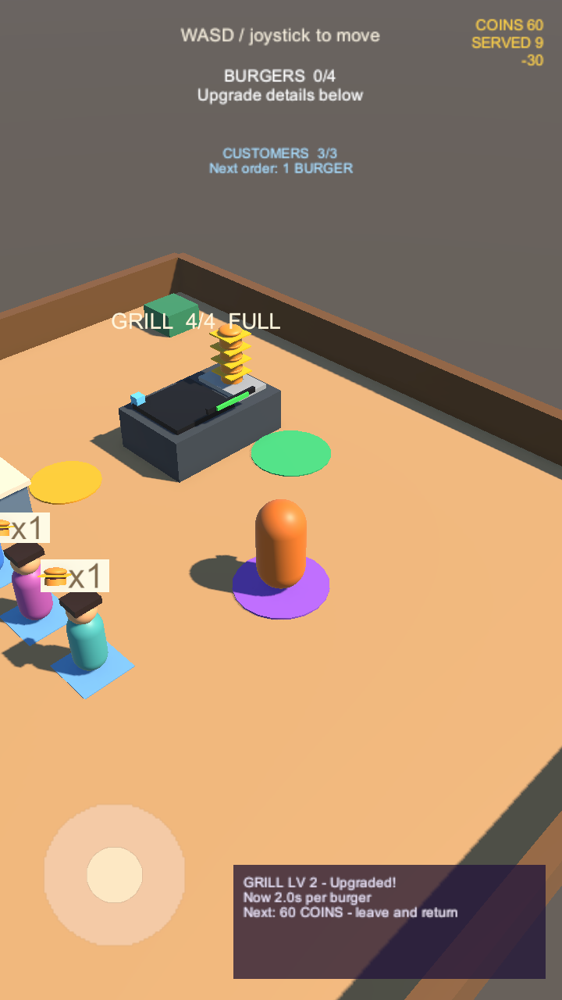

# Goal 06：金币与升级点

## 玩家体验

在 `Assets/Scenes/SampleScene.unity` 进入 Play Mode，先正常制作、取餐和送餐。每单仍收入 10 金币。

| 烤台等级 | 购买价格 | 每个汉堡制作时间 |
| --- | ---: | ---: |
| LV 1 | 初始 | 3 秒 |
| LV 2 | 30 金币 | 2 秒 |
| LV 3 | 60 金币 | 1.5 秒 |

1. 赚够 30 金币后，走到烤台前方的紫色圆形升级区。
2. 右下角面板显示等级、价格和制作时间变化。余额足够时，在区域内停留 1.5 秒，进度条走完后升级。
3. 购买成功显示新制作时间，右上角显示 `-30`，并播放交易提示音；烤台亮起一盏蓝色等级灯。
4. 每次进入区域最多买一级。要买第二次升级，需离开再回来，并准备 60 金币。满级后亮两盏灯，显示 `MAX`，不会再扣钱。
5. 余额不足时显示还差多少金币；中途离开会取消本次计时，尚未完成时不扣款。
6. 升级保留正在制作的进度比例和已有汉堡，玩家可继续取餐、送餐、收款。

升级只改变制作速度；烤台库存及玩家携带上限仍各为四个。金币和等级暂不保存，重新 Play 会恢复初始状态。

## 画面

以下是 Unity 实际渲染。临时截图工具设置玩家位置、队列和满烤台，并通过钱包接口准备 90 金币，然后用升级区的正常计时和扣款逻辑依次购买两次。截图用于布局与反馈检查；下面记录的场景测试独立验证实际售卖赚取金币后升级。

购买 LV 2 后：当前速度 2 秒、余额 60 金币、支出提示 -30。面板先说明已得到的效果，再提示下一次升级价格。



达到 LV 3 后：制作时间 1.5 秒、余额 0、支出提示 -60，后续停留不再消费。


## 实现约定

- `RestaurantWallet.TrySpend(int)` 拒绝零、负数及超过余额的消费。成功后精确扣款并发出 `CoinsSpent`，不改变 `CompletedSales`。
- `GrillUpgradeZone` 绑定烤台、钱包、玩家和升级点。正式位置 `(2, 0.02, -2.8)`，XZ 半径 1，购买需累计停留 1.5 秒。
- 只有依赖均启用、玩家在区域内、资金足够且本次进入尚未购买时才计时。离开、资金变得不足或依赖禁用会清除部分进度；暂停不推进。
- 每帧最多计入 0.1 秒，避免单个长帧让路过变成即时购买。低于每秒十帧时实际停留会更长。
- 扣款前先锁定本次进入的购买状态，防止消费事件回调重入造成连买。成功后等级增加并更新制作时间；满级不再购买。
- `ProductionStation.SetProductionSeconds` 只改变周期，按原进度比例换算已用时间，保留输出锚点、已有模型及库存；满库存没有额外积累的生产时间。非法周期被拒绝。
- `UpgradeHud` 仅在区域内显示：价格、收益、进度、缺款、升级成功及满级。面板不截获触控，不影响移动摇杆；玩家可随时走出取消。
- 区域外显示悬浮价格标签，进入后隐藏，避免文字挡住角色。顶部携带提示切换为查看升级详情。
- `SalesHud` 正确显示支出负号；`SaleFeedback` 对收入和消费播放提示音。蓝色等级灯用于辨认已升级烤台。

## 验证记录

2026-09-11，Unity `6000.3.23f1`，独立 Git 工作目录：**43 passed / 0 failed**（39 项组件 + 4 项真实场景）。最终测试日志无 C# 编译错误、警告、异常或断言。原有 32 项测试全部回归通过，项目完整性检查和 `git diff --check` 通过。

新增十项组件测试覆盖钱包消费校验、缺款及范围、精确扣款和等级灯、每次进入单次购买及满级、中断计时、暂停/长帧、消费通知重入、进度与库存守恒、满库存升级后的新周期、非法周期。

`Goal06GameplayTests` 打开真实 SampleScene，用虚拟键盘操作角色：

1. 空钱包到升级区，验证显示还差 30 金币且不扣款。
2. 正常取餐、搬运和交付三次，收入累计 30 金币。
3. 走到紫色区域，完成停留并购买 LV 2，余额归零、成交笔数仍为三，显示 -30。
4. 在满烤台移出一个汉堡作为计时探针，通过正常 Update 测得补满约需 2 秒（容差 1.9–2.15 秒）。
5. 再正常取餐、送餐一次，余额增加到 10 金币；已服务顾客离场，队列补满，烤台保留 LV 2。

已检查 720×1280 竖屏的购买进度、成功与满级画面，以及 1280×720 横屏。截图启动时出现 Unity Editor SearchDatabase 缓存索引异常，仍成功生成预览；不含临时截图工具的最终测试没有该异常。截图工具未提交。

结果保存在本机忽略的 `Logs/goal06-results.xml` 和 `Logs/goal06-tests.log`。复现：

```sh
Unity -batchmode -projectPath "$TEST_PROJECT" \
  -runTests -testPlatform EditMode \
  -testResults "$TEST_RESULTS" -logFile "$TEST_LOG"
```

Goal 04 / 05 已合并，本功能直接基于 main `f40b77a`。本阶段验证范围为 Editor；员工、存档、Android 构建、真机操作与长期性能仍待后续阶段。
