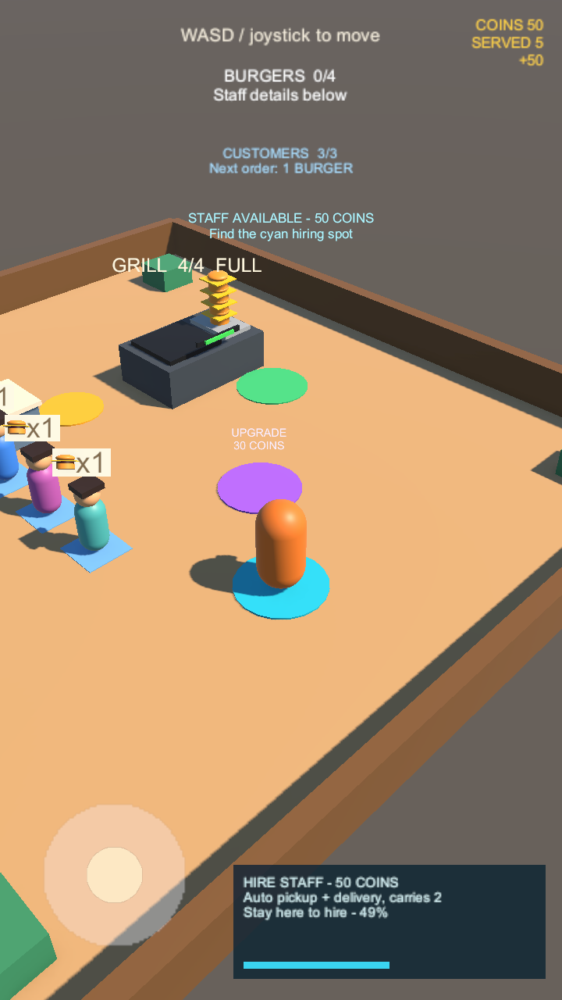
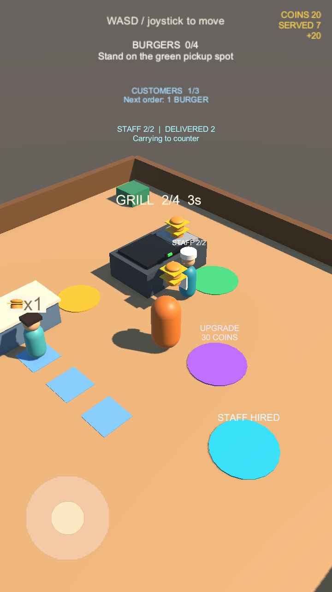
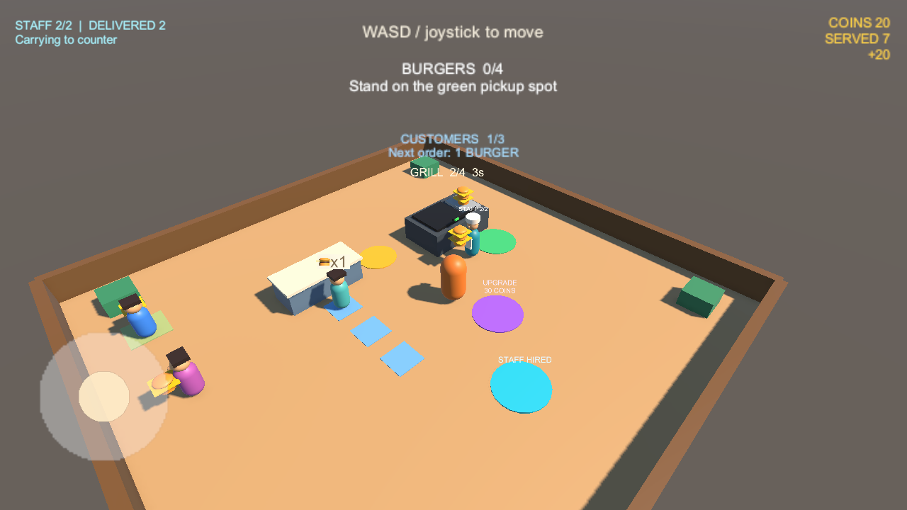

# Goal 07：员工自动搬运

## 玩家体验

在 SampleScene 进入 Play Mode，先靠正常取餐和送餐赚取金币。

1. 钱包达到 **50 金币**后，走到店铺前方的 **青色圆形雇佣区**，停留 **1.5 秒**。
2. 面板显示雇佣价格、能力和进度。缺款时提示还差多少金币；提前离开则取消进度，不扣款。
3. 成功后扣除 50 金币，生成一名青色制服、白帽员工。每局只雇佣一名，继续停留或再次进入均不再扣钱。
4. 员工沿通道走到绿色取餐点，最多取两个汉堡，再走到金色交付点向队首送餐；每单仍收入 10 金币。
5. 没有汉堡时等生产，没有就绪顾客时保留携带的汉堡等待。玩家可以停下观察自动营业，也能继续取餐和送餐。
6. 顶部显示员工携带数量、已送单数和当前活动；雇佣区显示已雇佣状态。

雇佣费与烤台升级共用钱包。玩家携带上限仍为四个，员工为两个。金币、烤台等级与员工暂不保存，重新 Play 恢复初始状态；存档留给 Goal 08。

## 画面

下图由 Unity 实际渲染。截图夹具通过钱包接口准备 50 金币，调用实际雇佣计时和扣款，并用正常组件推进员工取餐与送餐；不是实际玩家收入记录。手动赚钱雇佣的验证来自下述独立玩法测试。







## 实现约定

- `WorkerHiringZone` 绑定烤台、收银点、钱包、玩家与雇佣位置 `(0, 0.02, -5.5)`，XZ 半径 1。单次价格 50，累计停留 1.5 秒，每帧最多计入 0.1 秒，防止长帧误购。
- 离开、余额不足或依赖不可用清除部分进度。暂停不推进；扣款前锁定已雇佣状态，防止 CoinsSpent 事件回调重入重复购买。
- `RestaurantWorker` 使用固定场景通道 `(0.9, 0, 0.4)`，以 3.8 单位/秒往返取餐点与交付点；长帧依次经过路径拐点，不穿过烤台或点单台。员工为无阻挡 NPC，不阻塞玩家，不依赖 NavMesh。
- 员工状态为去取餐、等待/取餐、去交付、等待/交付。每 0.25 秒最多取一个；不足两份但已携带且烤台为空时直接出发，避免拿着可卖商品空等。
- 员工复用 `BurgerInventory`，通过 `Configure(2)` 设置容量；搬运的是烤台原有汉堡对象。玩家和员工顺序取同一库存，不复制商品。
- `BurgerServingZone.TryServeFrom(BurgerInventory)` 允许指定实际搬运者，检查交付距离、就绪顾客、携带量与钱包。只有收银点的 `Advance` 推进全局 0.75 秒交付冷却，额外搬运者调用不会加速收银。
- 交付先移出队首并锁定冷却，再转移原汉堡和结算；同一顾客只收一单。员工送单计数只记录本人成功交付，钱包计数包含玩家和员工。
- `StaffHud` 显示员工状态，雇佣面板仅在区域内出现，不截获摇杆触控。青色区域和紫色升级区域互不重叠。
- 员工销毁释放自建身体材质；携带汉堡仍由现有库存所有权逻辑释放。禁用员工暂停移动并保留携带库存，重新启用继续。

## 验证记录

2026-09-11，Unity `6000.3.23f1`：**55 passed / 0 failed**，共 50 项组件测试、5 项进入真实 SampleScene 的玩法测试。原有 43 项全部回归通过。最终测试日志无 C# 编译错误、警告、异常或断言；项目完整性检查和 `git diff --check` 通过。

新增 11 项组件用例覆盖：缺款与范围、计时取消、单次扣款、消费回调重入、暂停与禁用、长帧保护、空库存等待、无客保留商品、玩家/员工原对象分配、两种交付顺序防重复结算、全局收银冷却、连续自动营业与路径避障、材质释放。部分情形合并在同一测试方法中。

新增 `Goal07GameplayTests` 使用虚拟键盘和正常 Update：

1. 空钱包进入雇佣区，确认缺款面板，不产生员工。
2. 正常取餐和送餐五单，赚取 50 金币；等待新顾客从入口步行到队首。
3. 走进青色区域并完成停留，扣除 50 金币，生成且只生成一名员工。
4. 玩家移动到空地后停止输入；员工自动完成至少六单，携带不超过两个，钱包满足 `金币 = 总成交数 × 10 − 50`。
5. 玩家继续取餐和送餐，同时员工保持工作，验证手动成交再次增加且金额保持守恒。

已检查 720×1280 竖屏与 1280×720 横屏的雇佣和搬运画面；横屏员工状态移到左上角，避免挡住烤台和角色。截图期间出现 Unity Editor SearchDatabase 缓存索引异常，截图仍生成成功；不包含临时截图工具的玩法测试没有该异常。临时截图工具未提交。

测试结果与日志在本机忽略目录 `Logs/goal07-results.xml`、`Logs/goal07-tests.log`。复现：

```sh
Unity -batchmode -projectPath "$TEST_PROJECT" \
  -runTests -testPlatform EditMode \
  -testResults "$TEST_RESULTS" -logFile "$TEST_LOG"
```

本阶段依赖 Goal 06（PR #11）。验证范围为 Editor；单名员工、固定店铺路径，不含解雇、薪资、多员工调度、存档、Android 构建或真机性能验收。
