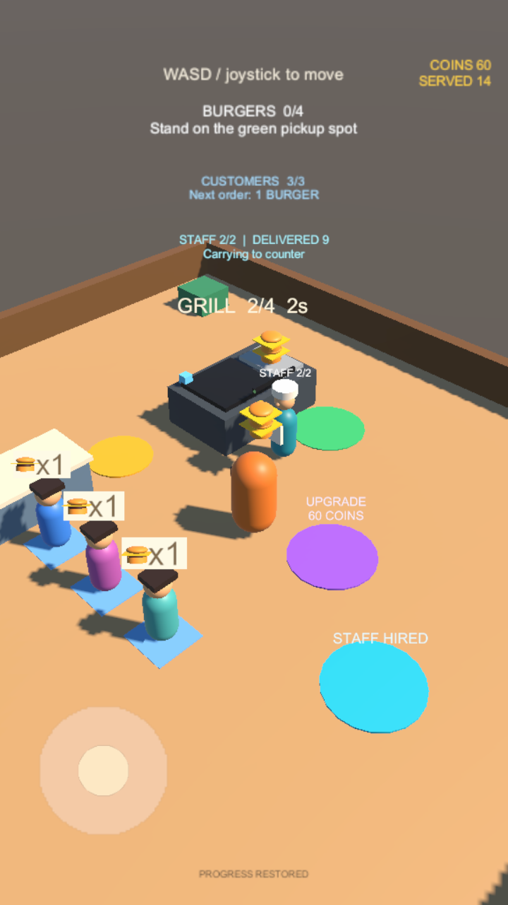

# Goal 09：Android 构建与设备验收

## 当前范围

本阶段已生成 Android 测试 APK，并完成手机安全区域适配和触控生命周期处理。Goal 08 存档已完成。真机安装、连续经营与性能验收需要一台授权连接的 Android 手机；没有实机结果前，不将 Goal 09 或完整 MVP 标记为已验收。

## 构建和安装

推荐使用项目根目录的脚本：

```sh
./scripts/build-android.sh
./scripts/install-android.sh
```

`UNITY_EDITOR` 和 `ADB` 可覆盖默认工具路径。构建默认使用 Unity 6000.3.23f1 配套 SDK / NDK / JDK。编辑器菜单为 `Burger Shop > Build Android Test APK`，仅适用于纯英文路径的项目。

Unity Android 工具拒绝包含非 ASCII 字符的项目路径。脚本会将 Assets、Packages 和 ProjectSettings 同步到独立的英文临时目录，并保留其 Library 供后续构建复用；不会移动正式项目或复制用户恢复场景。`ANDROID_BUILD_DIR` 可以指定一个新的英文构建目录，目录中的来源标记防止误覆盖另一个项目。

成功后将 APK 和 SHA-256 文件复制回 `Builds/Android/`；该目录不提交 Git。构建摘要与完整日志在 `Logs/android-build-summary.json` 和 `Logs/goal09-android-build.log`。安装脚本要求恰好一台授权设备、校验 ARM64 支持，使用 `adb install -r` 保留现有应用数据并启动游戏，不卸载或清空存档。

| 项目 | 配置 |
| --- | --- |
| 包名 | `com.ic3ma0.burgershop` |
| 版本 | `0.1.0`，versionCode 1 |
| 架构 | ARM64 / IL2CPP |
| 最低 Android | API 25，Android 7.1 |
| target SDK | API 35 |
| 方向 | 竖屏 |
| 渲染 | 既有 Mobile URP 配置，渲染比例 0.8 |
| 帧率目标 | 60 FPS；实际值需真机测量 |
| 签名 | 本地开发测试签名，不是商店发布签名 |
| 构建模式 | Development APK，可连接 Unity Profiler |

包名一旦用于实际玩家存档和覆盖安装，应保持稳定。Unity 在 Android 的 `Application.persistentDataPath` 通常位于应用专属外部文件目录 `Android/data/com.ic3ma0.burgershop/files`，具体以设备返回路径为准；卸载或清除数据会删除存档。Editor 的 companyName/productName 保持原值，不改变桌面试玩存档路径。

## 本机产物记录

2026-09-11 已成功构建 `BurgerShop-0.1.0-arm64.apk`：**42,876,892 字节（40.89 MiB）**，Unity 构建报告 0 error / 0 warning，编译约 172 秒。APK v2 开发签名、包名、SDK、ARM64 库和 zipalign 均验证通过，`libunity.so` / `libil2cpp.so` 的 LOAD 段对齐为 `0x4000`。这些检查不替代实机运行。

SHA-256：`bc704c2e0cfc035e2c1030acc13456b19b778b6aac53db735b75a28bfdb59c44`。验证明细为 `Logs/goal09-apk-verification.txt`，可分发目录另含 `build-info.json` 和 `.sha256`。

初次直接在中文项目路径构建被 Android 工具拒绝；英文暂存目录方案已实际构建通过。切换 Android 时 Unity 自动迁移 Mobile URP 和默认 Volume 配置，这些相关配置随本阶段提交。

已检查 Mobile URP 下的 720×1280 竖屏和 1280×720 横屏，模拟顶部 60、底部 30 像素安全边距。下图为 Editor 渲染，测试夹具预置存档用于检查恢复后的 UI，不是真机截图。截图启动出现既有 Unity SearchDatabase 索引异常，但截图成功，普通玩法测试无此异常，临时工具未提交。



## 手机适配

- UI 包含在 SafeArea 容器内，随屏幕尺寸和安全区域变化更新，避开刘海与系统手势区；空安全区域回退到全屏。
- 摇杆锁定最先按下的手指，第二根手指不会抢走方向或提前释放移动；松手、禁用、失焦和后台事件均清零。
- Android 上显示拖动摇杆提示。目标帧率设置为 60，使用原有 Mobile 质量配置；不将目标值表述为已达到的设备帧率。
- 存档在后台事件立即刷新。强制结束进程可能丢失最近两秒尚未提交的变更，正常重开恢复金币、等级与员工。

## 自动验证

Unity Editor：**72 项通过 / 0 失败**（65 项组件 + 7 项真实场景）。包括原有 68 项回归、新增竖横屏安全区与空尺寸测试，以及通过真实 Input System Touchscreen 事件驱动 UI 的玩法测试：手指按下/拖动使玩家移动，第二根手指不干扰，模拟后台消息后停止，重新触摸可恢复操作；后台保存消息写入可读取的存档。

这里的后台消息为 Editor 测试注入，不冒充 Android 实机生命周期验证。测试结果在 `Logs/goal09-results.xml`，日志在 `Logs/goal09-tests.log`。

## 真机验收清单

连接支持 ARM64 的 Android 7.1+ 手机，开启 USB 调试并允许这台 Mac 后执行安装脚本。验收时记录机型、系统版本、APK SHA-256 和结果。

- [ ] 首次启动成功，无黑屏、粉色材质、闪退或触控被系统边缘遮挡。
- [ ] 用摇杆完成至少三轮取餐、交付和收款，金额与库存正确。
- [ ] 购买烤台升级，雇佣员工，观察自动营业与手动协作。
- [ ] 按住摇杆切到后台，再返回时玩家已停止；可重新触摸操作。
- [ ] 后台后结束并重新启动应用，金币、等级、员工恢复且不重复收费。
- [ ] 连续经营至少十分钟，使用 Unity Profiler 记录帧时间、内存及温升体验，检查日志无持续异常。

只有这份清单在目标设备完成并记录证据后，才勾选 `docs/GOALS.md` 的 Goal 09。
