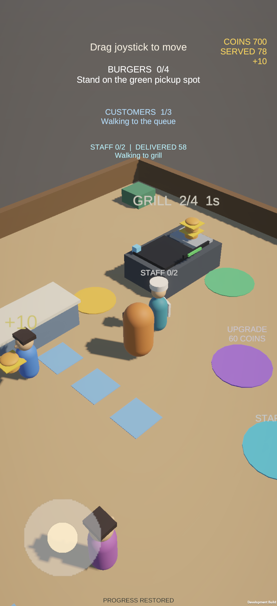
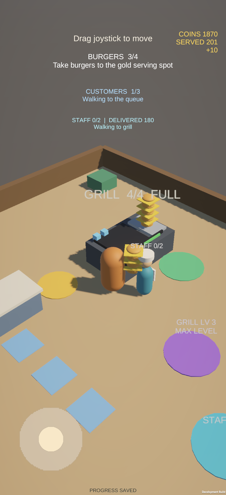

# vivo S50 真机验收：0.1.2

日期：2026-09-11。设备为用户 vivo S50，系统型号 V2528A / Android 16；物理屏幕 1260×2750，系统当前逻辑分辨率 1080×2358。通过 USB ADB 覆盖安装，未卸载或清除应用数据。

## 修复与产物

0.1.0 在真机发生运行时碰撞体缺失，启动在相机和 UI 配置前中断；进一步验证发现仅以名称查找的 URP shader 没有随包包含，透明 2D 材质兜底造成错误遮挡。0.1.2 显式保留必要碰撞体、打包 Lit / Unlit 资源材质并统一实例化，实际手机日志确认使用 `Universal Render Pipeline/Lit`，3D 深度关系和阴影恢复。

APK：`BurgerShop-0.1.2-arm64.apk`，versionCode 3，42,963,608 字节（40.97 MiB），包名 `com.ic3ma0.burgershop`。SHA-256：`b7f64764330eb893bf548069222becd6c8fccdb0d445618d2a99b7011eb6fbf3`。

ARM64 / IL2CPP / Development / Android Debug 签名。构建 0 error / 0 warning；15 种实际原生组件注册检查通过；构建日志确认编译两个 URP shader；APK v2 签名、包名、SDK、zipalign 16 KB 和 Unity / IL2CPP ELF LOAD 0x4000 对齐通过。Unity Editor 74/74 项测试通过，包含 7 项真实场景玩法和 2 项不透明材质资源回归。

## 真实操作结果

操作通过 Android 系统触摸事件驱动屏幕上的摇杆，不使用游戏内作弊接口。日志采样只读取状态。

- 覆盖安装后恢复之前的 40 金币、4 笔成交；角色位置按设计回到出生点。
- 连续三轮取餐 → 搬运 → 交付，每轮携带 4 个；共新增 12 笔成交，金币准确到 160。
- 花 50 金币雇佣员工，再花 30 金币升到 LV 2。员工独立送单；玩家又取餐并参与交付，合作区间成交增加 9，其中员工增加 5，证明玩家仍可共享收银点。
- 摇杆保持按下时切到 Android Home，返回后两次采样位置相同；新的触摸又能移动。
- 后台保存后 force-stop 仅结束本游戏进程，再次冷启动，长期进度恢复且没有重复收费。

| 进度 | 结束进程前的存档 | 冷启动后采样 |
| --- | ---: | ---: |
| 金币 | 690 | 690 |
| 成交 | 77 | 77 |
| 烤台等级 | 2 | 2 |
| 已雇佣员工 | True | True |
| 员工送单 | 57 | 57 |

存档位于本机 `/sdcard/Android/data/com.ic3ma0.burgershop/files/restaurant-save.json`，同时存在 `.bak`。冷启动后新增成交如发生，会按每单 10 金币增长；不计算离线收益。

## 持续经营采样

在重启后的独立进程中连续前台经营 617.0 秒，采集 307 个约两秒窗口。本轮以员工自动营业为主；最后阶段记录到手动移动、交付及 LV 3 升级，相关进度也保留。员工送单从 58 增至 179，金币从 700 增至 1860。期间在无交互的状态文字处轻点，防止手机的正常自动息屏；未修改系统休眠设置。

| 指标 | 实测 |
| --- | ---: |
| 两秒窗口 FPS 均值 | 59.19 |
| 最低两秒窗口 FPS | 45.02 |
| 最差窗口的 P95 帧间隔 | 22.23 ms |
| Unity 已分配内存范围 | 72.13–73.10 MiB |
| Android 进程 PSS（前 → 后） | 290.4 → 316.2 MiB |
| 系统电池温度范围 | 32.7–33.0 °C |
| 游戏错误日志 / 异常 | 0 |

FPS 和帧间隔来自 Unity `Time.unscaledDeltaTime`，内存来自 `Profiler.GetTotalAllocatedMemoryLong` 与 Android `dumpsys meminfo`。它们不是 GPU 帧分析或面板实际显示帧数；电池温度不是机壳体感温度。本结果覆盖这台设备及本次开发包，不代表其他机型或商店发布验收。多指隔离已由 Editor 的真实 Touchscreen 事件测试覆盖，本轮 ADB 真机测试以单指及生命周期为主。

## 真机截图与证据

原始本机证据保存在 `Logs/device-vivo/`：`cycles-result.json`、`cooperation-result.json`、`lifecycle-result.json`、`endurance-result.json`、`endurance-samples.json`、应用进程日志和内存记录。这里只提交游戏截图与汇总，不提交手机序列号或其他应用内容。
