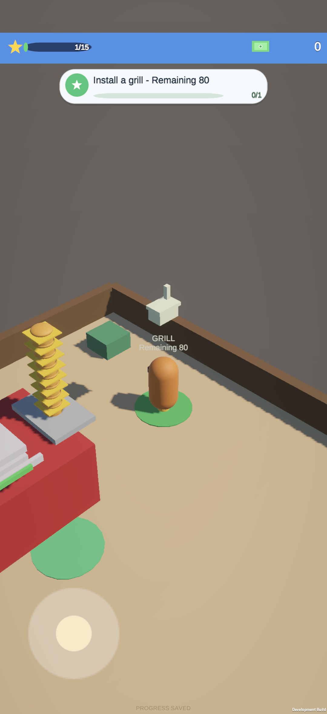
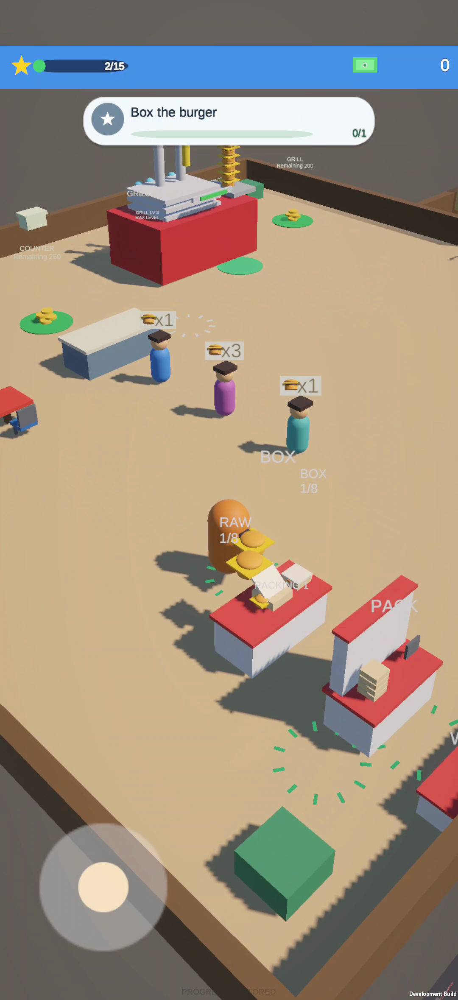
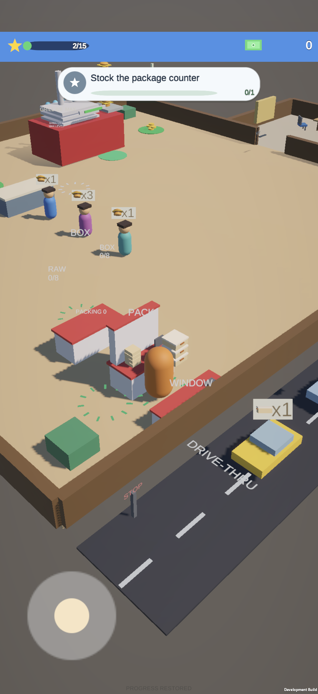
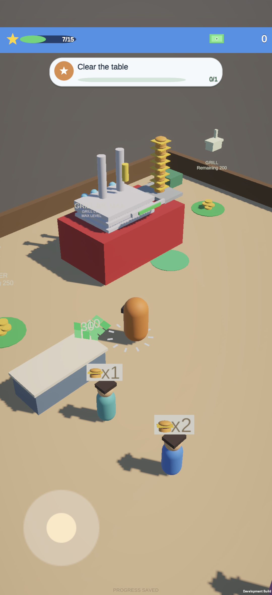

# 023–025 集成交付记录

日期：2026-09-12。开发版本 **0.2.0 / Android versionCode 4**。在正式 BurgerShop 仓库的本地 013–022 最新实现上继续开发，按 023 → 024 → 025 独立实现和验证。用户已授权采用三份 Spec 的建议参数；本轮未加入 P2/P3 候选功能。

## 功能与参数

- [023](BS-SPEC-023.md)：五处设施可分次投入。进入等待 0.3 秒，每 0.1 秒最多 10 金币，精确处理尾款；离开、没钱和后台停止。桌/烤炉/柜台/打包/车道总价仍为 150/200/250/150/250。
- [024](BS-SPEC-024.md)：堂食 1–4 件（50/30/15/5），车辆 1–2 盒（60/40）。堂食逐件飞行 0.35 秒、抵达后至少等 0.15 秒；车辆飞行 0.42 秒、两次起点至少隔 0.75 秒。末件抵达才成交、产生整单现金，单价仍为 10 / 15。员工按最终完成订单统计一次。
- [025](BS-SPEC-025.md)：RAW 输入 8、BOX 输出 8，在制最多 1 且预留输出位置；卸料/加工/收盒各 0.25 秒。有人操作才加工，多人不加速；盒子经过手持和 PACK 才能在窗口出售。员工按每线 4 的有限补货目标协调，散装批次首次堂食、双方缺货时交替，保留收银、清洁和垃圾处理。
- 当前订单锁定原柜台。若另一柜台有库存但当前订单所属柜台缺货，员工仍补足当前订单，不隔空取另一柜台的货；为此总堂食库存可能暂时超过缓冲目标 4。

## 已执行的本地验证

- 开发前基线 196/196；023 检查点 211/211；024 检查点 220/220；最终集成 **234/234**，无失败、无跳过。
- 023、024、025 的逐项 AC 结果、参数与代码位置见对应 Spec 的开发记录。
- 实际 SampleScene 验证了投入、订单缺货、末件结算、退出重进及键盘路径；打包区、PACK 与窗口可分别走入。
- 两次实际 SampleScene 的 Update 连续运行 120 秒：堂食固定 3 件、车辆固定 2 盒；1 名员工完成 2 单堂食 / 3 单车道，3 名员工完成 7 / 9。另有逐帧库存守恒模拟、30 次多人加工领取、全脏桌与满库存脱困、双柜台部分订单补货回归。
- 上述供给充足测试使用 0.1 秒产出、容量 8 的测试烤炉；正式包保持原有 Lv1/Lv2/Lv3 的 3/2/1.5 秒节奏。
- 原始 XML、场景截图、状态轨迹和日志：`Logs/spec023-025/`，最终测试文件 `final-results.xml` / `final-tests.log`。原始源码和两次阶段源码检查点均留存。

## Android 构建与体验方式

- APK：`Builds/Android/BurgerShop-0.2.0-arm64.apk`，61,220,858 字节。
- SHA-256：`8ff7f5d9d4ad1cf3ce1f27447329348f772c467d028a048435768c75bf65b89b`。
- Unity 6000.3.23f1、ARM64、IL2CPP、Development、竖屏；构建 0 error / 0 warning。15 种必要原生组件注册检查通过，APK v2 签名与旧 0.1.2 相同，zipalign 16 KB 检查通过。
- 包名仍为 `com.ic3ma0.burgershop`。使用 `bash scripts/install-android.sh` 覆盖安装，无需卸载。若 vivo 弹安装提示，需在手机允许。
- Unity 本地体验：用 6000.3.23f1 打开正式仓库，打开 `Assets/Scenes/SampleScene.unity` 后 Play，WASD 移动；Android 用屏幕左下摇杆。
- 体验入口：站入设施标记投入金币；从烤炉取汉堡到堂食柜台，站白圈逐件服务；解锁 BOX 和 LANE 后，在 BOX 卸料/加工/取盒，沿桌子西侧搬到 PACK，再站窗口圆圈服务车辆。员工已雇佣时会分担两线工作。

## 存档与交付状态

- 长期存档由 v6 升至 v7，新增五处已投入金币；v1–v6 原校验仍兼容。旧购设施免费保留，金币和既有升级/员工权益不重算。
- 订单、台面、手持、PACK 和落地现金仍为本次营业临时状态；重启按现有规则重建，不提供离线加工或未完成订单补偿。
- 真机测试先备份真实主存档与备份档；受控场景只使用临时验收存档，结束后恢复用户真实进度。原始 v1 的 2830 金币 / 297 单 / 275 员工送单正确迁移到 v7；在受控测试前又自然完成 3 单、清理 2 团垃圾。已恢复该真实 v7 存档，并再次冷启动逐字段核对：2830 金币、300 单、主烤炉 Lv3、1 员工、278 送单、2 清理均保留。
- 本轮代码和文档为本地集成状态；**未提交 PR、未合并、未发布**。GitHub main 的已合并基线与本地开发版应分开理解，不能用旧 MVP 验收代替这批功能的结果。

## 本轮 vivo 实测

设备 V2528A（vivo S50），Android 16；物理 1260×2750，当前逻辑 1080×2358。手机实际安装文件哈希与上面的 APK 完全一致。所有移动由 Android 触摸事件驱动屏幕摇杆；测试金币/购买初态通过临时验收存档准备，实际用户存档事先双份备份、结束后逐字段恢复。

- 分次投入：120→钱包 0 / 剩 80，离开、后台 10 秒、冷启动仍保留；测试补给 100 后只扣 80，钱包 20，建造一次。另测中途离开：1000→970 后停扣，重入再扣 170，最终 800。
- 三件堂食：交付 2 件后剩 1，不离队、不成交；补入末件后完成一单并掉落 30 现金。
- 两盒车辆：先实际存 1 盒到 PACK，再站窗口；第一盒抵达后车仍等待、剩 1，无成交。返回补货再进窗口后完成并生成 30 现金。
- 打包链路：4 个散装经台面输入/加工/输出/手持/PACK/窗口完整流转；RAW、BOX、合盖动作和剩余订单从录像核查。初版测试脚本绕行点碰到装饰箱，改用 x=-11.3 的正常通道后继续完成，证据分两段保存；游戏布局无需改动。
- 两组各约 124 秒录像包含两分钟自动经营。单员工前后采样堂食 0→3、车道 0→2、清理 0→6；三员工为堂食 1→10、车道 0→8、清理 0→16。准备走位时员工已开始正常工作；严格空库存起点的 AC-05 另由实际 SampleScene 的 120 秒测试覆盖。
- 单员工平均 59.41 FPS，最低两秒采样窗口 45.02，最差窗口 P95 22.23 ms，Unity 已分配内存 75.34–76.39 MiB。三员工平均 59.99 FPS，最低 58.03，最差 P95 16.67 ms，76.42–77.94 MiB。
- 本轮已采集的游戏日志无 Unity error / exception。曾有一次冷启动后诊断日志未采到，重新冷启动后采集恢复，三员工测试重新完整录制；该次空日志未作为验收依据。
- 性能来自开发包 `Time.unscaledDeltaTime` 和 Unity Profiler 内存，不是 GPU/面板帧率或其他机型结论；未复用旧 MVP 数据。

关键原始证据位于 `Logs/spec023-025/`：`vivo-spec023-result.json`、`vivo-spec023-exit-result.json`、`vivo-dining-three-result.json`、`vivo-player-flow-result.json`、`vivo-endurance-summary.json`、`vivo-final-restore-result.json`。录像为 `vivo-spec023-partial/complete/exit-return.mp4`、`vivo-three-unit-dining.mp4`、`vivo-player-box-pack-window-part1/part2.mp4`、`vivo-crew-1/3.mp4`。手机中的这些临时录像已下载到 Mac 后清理。

本轮要求的开发与验证已完成。未来多指专项、其他机型、长时间热稳定性和商店发布不属于这次已验证范围。当前使用既有占位资源，未额外引入美术功能或 P2/P3 候选。
